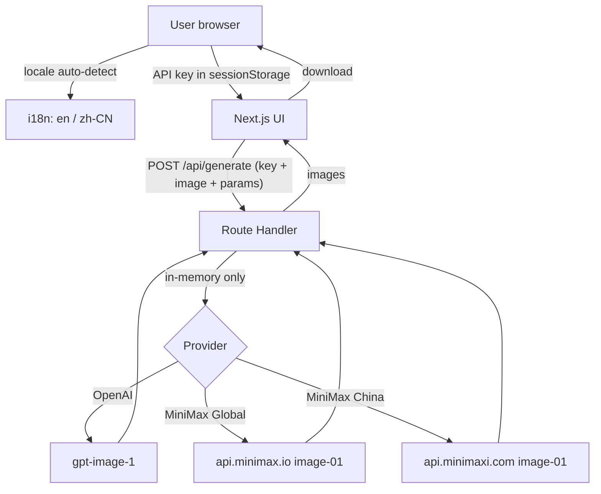
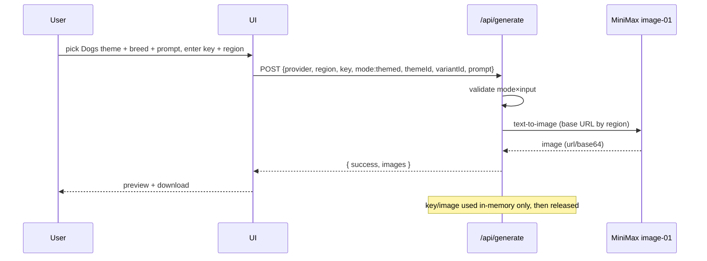

# Architecture

> Technical architecture, data flow, and module boundaries for Simi Avatar. See [prd.md](./prd.md) for the WHY/WHAT.

| Field | Value |
| ----- | ----- |
| App stack | Next.js (App Router) + TypeScript (strict) + Tailwind + Shadcn UI |
| Server | Next.js Route Handler (`/api/generate`) |
| i18n | English + Simplified Chinese (default English, locale auto-detected) |
| Reference deploy | Cloudflare Workers (OpenNext adapter) — see [cloudflare-deploy.md](./cloudflare-deploy.md) |
| Persistence | None (no DB / KV / R2 / D1 in MVP) |

## Overview



> The key and image flow through Route Handler **memory only** for a single request — never persisted, never logged (see [security.md](./security.md)).

## Generation modes

All modes share one provider abstraction, prompt engine, and `/api/generate` endpoint. They differ only in input shape and prompt assembly.

| Mode | Input | Endpoint family | Output |
| ---- | ----- | --------------- | ------ |
| `single` | 1 image | image-to-image | 1 |
| `couple` | 2 images | image-to-image ×2 (shared style) | 2 |
| `themed` | none | text-to-image | 1 |

## Module boundaries

| Module | Responsibility | Must not |
| ------ | -------------- | -------- |
| `components/*` | UI, mode/provider/theme selection, language switch | Talk to providers directly |
| `app/api/generate/route.ts` | Validate, assemble, proxy to provider, normalize errors | Persist or log key/image |
| `lib/providers/*` | Provider adapters (OpenAI, MiniMax) | Hold global state |
| `lib/prompt-builder.ts` | Mode-aware prompt assembly | Know about HTTP |
| `lib/preset.ts` | Encode/decode team preset (URL-safe) | Ever include an API key |
| `lib/image-utils.ts` | EXIF strip, downscale/compress | — |
| `lib/validation.ts` | Mode×input, size/type checks | — |
| `i18n/*` | en / zh-CN message catalogs | Contain secrets |

## Provider abstraction

```ts
type GenerationMode = "single" | "couple" | "themed";

interface ImageProvider {
  id: string;            // "openai" | "minimax"
  name: string;
  supportedModes: GenerationMode[];
  resolveBaseUrl?(region?: string): string; // MiniMax: global | china
  generateAvatar(input: {
    apiKey: string;
    region?: string;
    mode: GenerationMode;
    images?: File[];     // single:1 couple:2 themed:0
    prompt: string;
    styleId?: string;
    themeId?: string;
    variantId?: string;
    size: "512x512" | "1024x1024";
  }): Promise<GeneratedImage[]>;
}
```

### MiniMax region resolution

MiniMax runs two independent platforms with separate keys and base URLs:

| Region | Base URL | Image endpoint |
| ------ | -------- | -------------- |
| Global | `https://api.minimax.io` | `POST /v1/image_generation` |
| China | `https://api.minimaxi.com` | `POST /v1/image_generation` |

`resolveBaseUrl(region)` returns the correct base; the UI surfaces the region so a Global key is never sent to the China endpoint (and vice versa). See [providers.md](./providers.md).

## Request sequence (themed example)



## i18n

- Catalogs: `i18n/en.json` (source), `i18n/zh-CN.json`.
- Initial locale auto-detected from `Accept-Language` / `navigator.language`; falls back to **English**.
- A manual switcher persists the choice in `localStorage`.
- Routing via `app/[locale]/...`.

## Runtime constraints

- Synchronous request → wait → single response; client timeout ~60s (`PROVIDER_TIMEOUT`).
- Client compresses/downscales images before upload; server caps body size (`IMAGE_TOO_LARGE`).
- No server-side queue in MVP; public demo throttles via per-IP rate limiting.
- Document host plan differences (e.g. Cloudflare Free vs Paid CPU/subrequests) in the deploy guide.

## Error handling

Adapters map provider errors to a normalized set: `INVALID_API_KEY`, `INSUFFICIENT_CREDITS`, `INVALID_IMAGE`, `IMAGE_TOO_LARGE`, `UNSUPPORTED_FILE_TYPE`, `INVALID_MODE_INPUT`, `INVALID_REGION`, `PROVIDER_TIMEOUT`, `CONTENT_REJECTED`, `RATE_LIMITED`, `UNKNOWN_ERROR`.

## Security constraints (summary)

- Key/image in-memory only; never persisted or logged.
- Preset codes never contain a key.
- EXIF stripped client-side.
- Full details in [security.md](./security.md).
