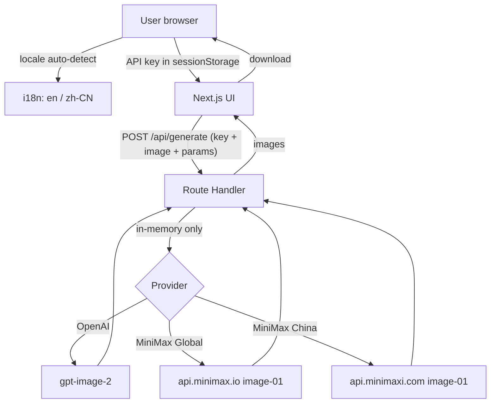
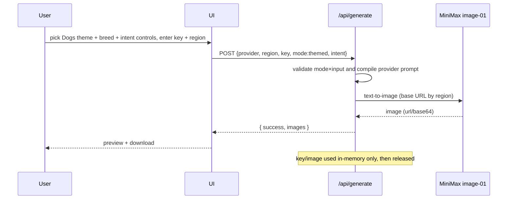
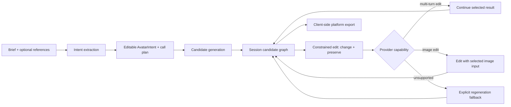

# Architecture

> Technical architecture, data flow, and module boundaries for Simi Avatar. See [prd.md](./prd.md) for the WHY/WHAT.

| Field            | Value                                                                                      |
| ---------------- | ------------------------------------------------------------------------------------------ |
| App stack        | Next.js (App Router) + TypeScript (strict) + Tailwind + Shadcn UI                          |
| Server           | Next.js Route Handler (`/api/generate`)                                                    |
| i18n             | English + Simplified Chinese (default English, locale auto-detected)                       |
| Reference deploy | Cloudflare Workers (OpenNext adapter) — see [cloudflare-deploy.md](./cloudflare-deploy.md) |
| Persistence      | None (no DB / KV / R2 / D1 in MVP)                                                         |

## Overview


```mermaid
flowchart TD
  U[User browser] -->|locale auto-detect| I18N[i18n: en / zh-CN]
  U -->|API key in sessionStorage| FE[Next.js UI]
  FE -->|"POST /api/generate (key + image + params)"| API[Route Handler]
  API -->|in-memory only| PROV{Provider}
  PROV -->|OpenAI| OAI[gpt-image-2]
  PROV -->|MiniMax Global| MMG[api.minimax.io image-01]
  PROV -->|MiniMax China| MMC[api.minimaxi.com image-01]
  OAI --> API
  MMG --> API
  MMC --> API
  API -->|images| FE
  FE -->|download| U
```

> The key and image flow through Route Handler **memory only** for a single request — never persisted, never logged (see [security.md](./security.md)).

## Generation modes

All modes share one provider abstraction, intent model, prompt compiler, and `/api/generate` endpoint. They differ only in input shape and provider request family.

| Mode          | Input    | Endpoint family                  | Output |
| ------------- | -------- | -------------------------------- | ------ |
| `text`        | none     | text-to-image                    | 1      |
| `couple-text` | none     | text-to-image ×2 (shared style)  | 2      |
| `single`      | 1 image  | image-to-image                   | 1      |
| `couple`      | 2 images | image-to-image ×2 (shared style) | 2      |
| `themed`      | none     | text-to-image                    | 1      |

## Module boundaries

| Module                        | Responsibility                                             | Must not                   |
| ----------------------------- | ---------------------------------------------------------- | -------------------------- |
| `components/*`                | UI, intent/mode/provider/theme selection, language switch  | Talk to providers directly |
| `app/api/generate/route.ts`   | Validate, normalize intent, proxy to provider, map errors  | Persist or log key/image   |
| `lib/avatar-intent.ts`        | Canonical intent, goal presets, refinement actions         | Know provider HTTP details |
| `lib/prompt-compiler.ts`      | Compile one intent into provider-specific prompt payloads  | Touch API keys/images      |
| `lib/provider-calibration.ts` | Provider/style prompt profiles, known bias, recovery hints | Contain user data/secrets  |
| `lib/providers/*`             | Provider adapters (OpenAI, MiniMax, fal.ai)                 | Hold global state          |
| `lib/prompt-builder.ts`       | Backward-compatible prompt-builder wrapper                 | Know about HTTP            |
| `lib/preset.ts`               | Encode/decode team preset (URL-safe)                       | Ever include an API key    |
| `lib/image-utils.ts`          | EXIF strip, downscale/compress                             | —                          |
| `lib/validation.ts`           | Mode×input, size/type checks                               | —                          |
| `i18n/*`                      | en / zh-CN message catalogs                                | Contain secrets            |

## Provider abstraction

```ts
type GenerationMode = "text" | "couple-text" | "single" | "couple" | "themed";

interface ImageProvider {
  id: string; // "openai" | "minimax"
  name: string;
  supportedModes: GenerationMode[];
  resolveBaseUrl?(region?: string): string; // MiniMax: global | china
  generateAvatar(input: {
    apiKey: string;
    region?: string;
    mode: GenerationMode;
    images?: File[]; // text/couple-text/themed:0 single:1 couple:2
    prompt: string;
    negativePrompt?: string;
    referenceStrength?: number;
    styleId?: string;
    themeId?: string;
    variantId?: string;
    size: "512x512" | "1024x1024";
  }): Promise<GeneratedImage[]>;
}
```

The final `prompt` is compiled server-side from `AvatarIntent`; UI components never assemble provider prompt strings directly. See [provider-calibration.md](./provider-calibration.md).

### MiniMax region resolution

MiniMax runs two independent platforms with separate keys and base URLs:

| Region | Base URL                   | Image endpoint              |
| ------ | -------------------------- | --------------------------- |
| Global | `https://api.minimax.io`   | `POST /v1/image_generation` |
| China  | `https://api.minimaxi.com` | `POST /v1/image_generation` |

`resolveBaseUrl(region)` returns the correct base; the UI surfaces the region so a Global key is never sent to the China endpoint (and vice versa). See [providers.md](./providers.md).

## Request sequence (themed example)


```mermaid
sequenceDiagram
  participant U as User
  participant FE as UI
  participant API as /api/generate
  participant P as MiniMax image-01
  U->>FE: pick Dogs theme + breed + intent controls, enter key + region
  FE->>API: POST {provider, region, key, mode:themed, intent}
  API->>API: validate mode×input and compile provider prompt
  API->>P: text-to-image (base URL by region)
  P-->>API: image (url/base64)
  API-->>FE: { success, images }
  FE-->>U: preview + download
  Note over API: key/image used in-memory only, then released
```

## i18n

- Catalogs: `i18n/en.json` (source), `i18n/zh-CN.json`.
- Initial locale auto-detected from `Accept-Language` / `navigator.language`; falls back to **English**.
- A manual switcher persists the choice in `localStorage`.
- Routing via `app/[locale]/...`.

## Runtime constraints

- Synchronous request → wait → single response; provider timeout ~120s (`PROVIDER_TIMEOUT`).
- Client compresses/downscales images before upload; the route pre-rejects oversized `Content-Length` and stream-counts requests without `Content-Length` before JSON/form parsing (`IMAGE_TOO_LARGE`).
- No server-side queue in MVP; public demo should use Cloudflare WAF/Rate Limiting and optional Turnstile at the edge, with the app's instance-local `RATE_LIMIT_PER_MINUTE` guard as a self-host/default fallback.
- Document host plan differences (e.g. Cloudflare Free vs Paid CPU/subrequests) in the deploy guide.

## Error handling

Adapters map provider errors to a normalized set: `INVALID_API_KEY`, `INSUFFICIENT_CREDITS`, `INVALID_IMAGE`, `IMAGE_TOO_LARGE`, `UNSUPPORTED_FILE_TYPE`, `INVALID_MODE_INPUT`, `INVALID_REGION`, `PROVIDER_TIMEOUT`, `CONTENT_REJECTED`, `RATE_LIMITED`, `UNKNOWN_ERROR`.

## Security constraints (summary)

- Key/image in-memory only; never persisted or logged.
- Preset codes never contain a key.
- EXIF stripped client-side.
- Full details in [security.md](./security.md).

## M11 conversational generation architecture

M11 adds a short-lived orchestration layer above the existing provider adapters. It does not add
persistence or make Cloudflare a product-level requirement.


```mermaid
flowchart LR
  B["Brief + optional references"] --> I["Intent extraction"]
  I --> P["Editable AvatarIntent + call plan"]
  P --> G["Candidate generation"]
  G --> S["Session candidate graph"]
  S --> E["Constrained edit: change + preserve"]
  E --> C{"Provider capability"}
  C -->|multi-turn edit| T["Continue selected result"]
  C -->|image edit| R["Edit with selected image input"]
  C -->|unsupported| F["Explicit regeneration fallback"]
  T --> S
  R --> S
  F --> S
  S --> X["Client-side platform export"]
```

### Session model

`GenerationSession` is client-owned, memory-only state for the current page lifetime:

```ts
type CandidateNode = {
  id: string;
  parentId?: string;
  operation: "generate" | "edit" | "regenerate";
  intent: AvatarIntent;
  change?: string[];
  preserve?: string[];
  image: GeneratedImage;
  providerContext?: ProviderContinuation;
};

type GenerationSession = {
  id: string;
  candidates: CandidateNode[];
  selectedCandidateId?: string;
};
```

The concrete implementation may split image bytes from metadata, but must keep both ephemeral.
`providerContext` may contain an upstream response/image ID only when required for continuation; it
must never enter local history, URLs, analytics, logs, or error payloads.

### Provider operation interface

The existing `generateAvatar` path remains supported while adapters move toward operation-specific
methods:

```ts
interface ConversationalImageProvider extends ImageProvider {
  capabilities: ProviderCapabilitiesV2;
  generateCandidates(input: GenerateCandidatesInput): Promise<GenerationResult>;
  editCandidate?(input: EditCandidateInput): Promise<GenerationResult>;
}
```

`EditCandidateInput` carries the selected image or provider continuation plus explicit `change` and
`preserve` constraints. The route chooses one of three truthful execution paths:

1. `conversation` — continue upstream context where supported.
2. `image-edit` — submit the selected result as a new edit input.
3. `regenerate` — compile the full accumulated intent again and label the result accordingly.

### New module boundaries

| Module | Responsibility | Must not |
| ------ | -------------- | -------- |
| `lib/generation-session.ts` | Candidate graph and selection transforms | Persist bytes or provider IDs |
| `lib/provider-capabilities.ts` | Verified operation/capability truth | Infer support from provider name |
| `lib/edit-intent.ts` | Normalize `change` / `preserve` constraints | Call providers |
| `lib/avatar-evaluation/*` | Versioned fixtures, rubrics, score aggregation | Contain private user photos or keys |
| `lib/export/*` | Client-side crops, safe areas, output manifests | Upload exported images |

### Request and privacy boundaries

- Candidate bytes may pass browser → route → provider for one edit request and are released after
  the response, following the same rules as source uploads.
- Provider continuation IDs are sensitive session metadata even when they are not credentials.
- A page reload may intentionally destroy the active session. Local history continues to store only
  safe intent metadata, never images or continuation IDs.
- Multi-reference requests reuse client EXIF stripping, compression, content validation, fixed-host
  allowlists, and total request-size enforcement.

### Evaluation gate

Unit and mocked-fetch tests remain mandatory, but M11 also adds an opt-in provider evaluation
harness. It records only fixture IDs, model/version, normalized settings, rubric scores, latency,
and call/cost metadata. Generated fixture outputs are gitignored local artifacts unless their
license and inclusion are explicitly approved.
