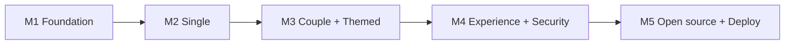

# Plan — Simi Avatar

> Product roadmap and milestones. Upstream: [prd.md](../prd.md). Epics: [epics/](./epics/).

| Field | Value |
| ----- | ----- |
| Status | MVP code complete (M1–M5 implemented; Cloudflare deploy pending) |
| Scope | MVP (M1–M5) |
| Providers (MVP) | OpenAI + MiniMax |
| Languages (MVP) | English (default) + Simplified Chinese |

## Milestones

| Milestone | Goal | Epic |
| --------- | ---- | ---- |
| M1 | Project foundation, i18n scaffold, home + generate layout | [epic-1.1](./epics/epic-1.1-foundation.md) |
| M2 | Single-mode closed loop (OpenAI + MiniMax) | [epic-2.1](./epics/epic-2.1-single-mode.md) |
| M3 | Couple + themed + team preset | [epic-3.1](./epics/epic-3.1-couple-and-themed.md) |
| M4 | Experience, security & quality | [epic-4.1](./epics/epic-4.1-experience-and-security.md) |
| M5 | Open source, docs & deployment | [epic-5.1](./epics/epic-5.1-open-source-and-deploy.md) |

## Stage goals

- **M1 — Foundation**: Next.js + TS strict + Tailwind + Shadcn; i18n (EN default + zh-CN, locale auto-detect); home page; generate-page layout with mode-switch skeleton.
- **M2 — Single loop**: API key input + `sessionStorage`; upload + EXIF strip; style picker; mode-aware prompt builder; **OpenAI and MiniMax** adapters (MiniMax region-aware); `/api/generate`.
- **M3 — Playful modes**: couple paired generation; themed text-to-image; Dogs theme + breed variants; stateless team preset link.
- **M4 — Experience & security**: error handling + codes; download/regenerate/Clear Key; mode×input validation; timeout + per-IP rate limit; log redaction + CI guard; mobile + a11y; core unit tests ≥ 80%.
- **M5 — Open source & deploy**: finalize English docs + legal pages; Wrangler config; GitHub Actions CI; deploy Cloudflare Workers + bind domain.

## Dependencies

## Definition of done (MVP)

- Three modes work end-to-end with OpenAI **and** MiniMax (region-aware).
- EN/zh-CN i18n with English default and locale auto-detection.
- Security acceptance checklist passes ([security.md](../security.md)).
- Core lib unit coverage ≥ 80%; CI green.
- All docs in English; Cloudflare deploy succeeds.
