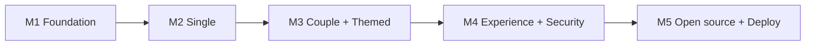

# Plan — Simi Avatar

> Product roadmap and milestones. Upstream: [prd.md](../prd.md). Epics: [epics/](./epics/).

| Field           | Value                                                            |
| --------------- | ---------------------------------------------------------------- |
| Status          | MVP complete; public demo deployed; M9 expansion in progress |
| Scope           | MVP (M1–M5)                                                      |
| Providers (MVP) | OpenAI + MiniMax                                                 |
| Languages (MVP) | English (default) + Simplified Chinese                           |

## Milestones

| Milestone | Goal                                                      | Epic                                                    |
| --------- | --------------------------------------------------------- | ------------------------------------------------------- |
| M1        | Project foundation, i18n scaffold, home + generate layout | [epic-1.1](./epics/epic-1.1-foundation.md)              |
| M2        | Single-mode closed loop (OpenAI + MiniMax)                | [epic-2.1](./epics/epic-2.1-single-mode.md)             |
| M3        | Couple + themed + team preset                             | [epic-3.1](./epics/epic-3.1-couple-and-themed.md)       |
| M4        | Experience, security & quality                            | [epic-4.1](./epics/epic-4.1-experience-and-security.md) |
| M5        | Open source, docs & deployment                            | [epic-5.1](./epics/epic-5.1-open-source-and-deploy.md)  |

## Stage goals

- **M1 — Foundation**: Next.js + TS strict + Tailwind + Shadcn; i18n (EN default + zh-CN, locale auto-detect); home page; generate-page layout with mode-switch skeleton.
- **M2 — Single loop**: API key input + `sessionStorage`; upload + EXIF strip; style picker; mode-aware prompt builder; **OpenAI and MiniMax** adapters (MiniMax region-aware); `/api/generate`.
- **M3 — Playful modes**: couple paired generation; themed text-to-image; Dogs theme + breed variants; stateless team preset link.
- **M4 — Experience & security**: error handling + codes; download/regenerate/Clear Key; mode×input validation; timeout + edge rate limiting guidance with app-level fallback; log redaction + CI guard; mobile + a11y; core unit tests ≥ 80%.
- **M5 — Open source & deploy**: finalize English docs + legal pages; Wrangler config; GitHub Actions CI; deploy Cloudflare Workers + bind domain.

## Current progress snapshot (2026-06-11)

- **M1–M5 are complete**: foundation, i18n, five generation modes, provider adapters, intent-first prompt compilation, security guards, open-source docs, CI, and Cloudflare deployment are implemented.
- **Public demo is live**: `https://avatar.simi.studio/zh-CN` returns `HTTP/2 200` on Cloudflare/OpenNext with the custom domain bound.
- **GitHub repository metadata is set**: `simi-studio/avatar` is public, has a concise description, homepage URL, and topics configured.
- **Local verification passed on 2026-06-11**: `npm run guard:secrets`, `npm run lint`, `npm run typecheck`, `npm run test` (104 tests), and `npm run build`.
- A local gitignored `wrangler.prod.jsonc` exists for `avatar.simi.studio`; the open-source deliverable remains `wrangler.prod.jsonc.example`.
- **Screenshots are intentionally deferred** while the product is changing quickly; keeping screenshots current would create avoidable maintenance churn.

## Dependencies

## Definition of done (MVP)

- Five modes work end-to-end with OpenAI **and** MiniMax (region-aware).
- EN/zh-CN i18n with English default and locale auto-detection.
- Security acceptance checklist passes ([security.md](../security.md)).
- Core lib unit coverage ≥ 80%; CI green.
- All docs in English; Cloudflare deploy succeeds.

## Recommended next implementation queue

> These items are now tracked under **M9** and split across the M9 epics below
> ([9.1](./epics/epic-9.1-provider-and-theme-expansion.md) /
> [9.2](./epics/epic-9.2-generation-experience-upgrade.md) /
> [9.3](./epics/epic-9.3-engineering-health-and-confidence.md)).

- [ ] **Add a lightweight release checklist** (Epic 9.3): document the repeatable flow for local gate, deploy, smoke check, and rollback before tagging releases.
- [ ] **Migrate lint script before Next.js 16** (Epic 9.3): replace deprecated `next lint` with the ESLint CLI flow.
- [ ] **Add optional E2E browser smoke tests** (Epic 9.3): cover home → generate, locale switch, source/mode changes, team preset hydration, and invalid-key error display with mocked generation.
- [ ] **Consider production observability notes** (Epic 9.3): document how maintainers check Cloudflare logs without exposing keys, prompts, or uploaded images.

## Post-MVP enhancements (M6)

Shipped after the original M1–M5 scope, all gated by the same lint/typecheck/test/build pipeline:

- [x] **Two input sources**: a top-level switch between **Text to avatar** (default, no upload — pick a style + short description) and **From a photo** (single/couple restyle). Modes are nested under each source.
- [x] **Text-to-avatar mode** (`text`): low-friction text-to-image generation with no face reference, supported by both OpenAI and MiniMax.
- [x] **Text couple mode** (`couple-text`): describe a couple and generate a style-matched pair (two labeled A/B generations, shared style + paired consistency) with no photo upload.
- [x] **Provider-specific prompt suggestions**: starter prompt chips tailored to OpenAI vs MiniMax, shown for description-first modes.
- [x] **Dark / light theme**: local system-aware theme toggle in the header, EN/zh-CN labels.
- [x] **Makefile task runner**: `make help/check/qa/deploy/deploy-prod` wrappers over the npm scripts.
- [x] **Production deploy config**: gitignored `wrangler.prod.jsonc` (+ committed `.example`) for binding a custom domain without leaking production-private details into the open-source repo.

## Intent-first generation (M7)

Shipped from the Recommended Next 10 queue, preserving BYOK/no-login/no-database constraints:

- [x] **AvatarIntent model**: canonical intent fields for goal, style/theme, likeness, creativity, composition, background, palette, mood, accessories, avoid-list, paired consistency, and variation.
- [x] **Provider-specific prompt compiler**: one intent compiles into OpenAI natural-language prompts and MiniMax concise descriptor prompts, with modeled request options.
- [x] **Goal-first presets**: professional profile, social avatar, team character, and character presets fill editable intent controls.
- [x] **Direct controls**: likeness/creativity, composition/background, palette/mood/accessories/avoid-list in the generate page.
- [x] **One-click refinement**: closer likeness, more realistic, cuter, cleaner background, and try variation from the result view.
- [x] **Calibration matrix**: provider/style prompt fragments, known bias, recovery hints, and tests for every built-in style/provider pair.
- [x] **Compact chip pickers**: built-in styles and theme variants render as text chips (no preview thumbnails), keeping the generate form short and the Generate button reachable without excessive scrolling.

## Generate UX rationalization (M8)

Shipped after M7 to make the completed feature set easier to use and more truthful about provider behavior:

- [x] **Provider-aware size capabilities**: OpenAI exposes only the app-supported `1024x1024` square size; MiniMax exposes `512x512` and `1024x1024`.
- [x] **Quick / advanced form split**: first-run generation keeps required controls visible while AvatarIntent details and size live under Advanced settings.
- [x] **Preview workspace states**: uploaded source images appear in the preview panel before generation, ready/error states are distinct, and failed requests can be retried.
- [x] **Partial couple result handling**: pair modes show an explicit partial-success notice and missing A/B placeholders when only one avatar returns.
- [x] **Contextual team preset sharing**: preset links appear only for themed, couple, or team-character contexts.
- [x] **Generation count cues**: the form shows whether the current mode runs one generation or two.

## Post-MVP expansion (M9, in progress)

Three parallel epics, all gated by the same lint/typecheck/test/build pipeline and bound by
the BYOK / no-login / no-database red lines:

- **[Epic 9.1 — Provider & Theme Expansion](./epics/epic-9.1-provider-and-theme-expansion.md)**:
  add more themes (Cats / Robots / Pixel Heroes) and at least one new provider (Fal.ai / Replicate /
  Stability) behind the shared `ImageProvider` interface.
- **[Epic 9.2 — Generation Experience Upgrade](./epics/epic-9.2-generation-experience-upgrade.md)**:
  couple same-frame composite, provider side-by-side comparison, copyable compiled prompt, and
  client-only local history.
- **[Epic 9.3 — Engineering Health & Confidence](./epics/epic-9.3-engineering-health-and-confidence.md)**:
  E2E smoke tests, lint migration, release/rollback checklist, and production observability notes.

### M9 progress

- [x] 9.1 — New themes (Cats / Robots / Pixel Heroes)
- [x] 9.1 — New provider behind `ImageProvider` (fal.ai / FLUX)
- [x] 9.2 — Copyable compiled prompt
- [x] 9.2 — Couple same-frame composite (couple-text; photo couple is a follow-up)
- [ ] 9.2 — Provider side-by-side comparison
- [x] 9.2 — Client-only local history
- [x] 9.3 — Lint migration to ESLint CLI
- [x] 9.3 — E2E browser smoke tests
- [x] 9.3 — Release checklist + observability notes
