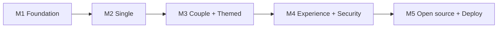
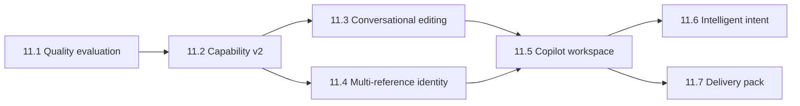

# Plan — Simi Avatar

> Product roadmap and milestones. Upstream: [prd.md](../prd.md). Epics: [epics/](./epics/).

| Field           | Value                                                            |
| --------------- | ---------------------------------------------------------------- |
| Status          | MVP complete; M10.1–10.3 shipped; M11 in progress; M12 first-impression in progress |
| Scope           | MVP (M1–M5)                                                      |
| Providers (MVP) | OpenAI + MiniMax                                                 |
| Languages (MVP) | English (default) + Simplified Chinese                           |

## Milestones

| Milestone | Goal                                                      | Epic                                                    |
| --------- | --------------------------------------------------------- | ------------------------------------------------------- |
| M1        | Project foundation, i18n scaffold, home + generate layout | [epic-1.1](./epics/epic-1.1-foundation.md)              |
| M2        | Single-mode closed loop (OpenAI + MiniMax)                | [epic-2.1](./epics/epic-2.1-single-mode.md)             |
| M3        | Couple + themed + team preset                             | [epic-3.1](./epics/epic-3.1-couple-and-themed.md)       |
| M4        | Experience, security & quality                            | [epic-4.1](./epics/epic-4.1-experience-and-security.md) |
| M5        | Open source, docs & deployment                            | [epic-5.1](./epics/epic-5.1-open-source-and-deploy.md)  |

## Stage goals

- **M1 — Foundation**: Next.js + TS strict + Tailwind + Shadcn; i18n (EN default + zh-CN, locale auto-detect); home page; generate-page layout with mode-switch skeleton.
- **M2 — Single loop**: API key input + `sessionStorage`; upload + EXIF strip; style picker; mode-aware prompt builder; **OpenAI and MiniMax** adapters (MiniMax region-aware); `/api/generate`.
- **M3 — Playful modes**: couple paired generation; themed text-to-image; Dogs theme + breed variants; stateless team preset link.
- **M4 — Experience & security**: error handling + codes; download/regenerate/Clear Key; mode×input validation; timeout + edge rate limiting guidance with app-level fallback; log redaction + CI guard; mobile + a11y; core unit tests ≥ 80%.
- **M5 — Open source & deploy**: finalize English docs + legal pages; Wrangler config; GitHub Actions CI; deploy Cloudflare Workers + bind domain.

## M12 — First impression and first success

Pulled forward from the 2026-08-13 review: the product is engineered well and hard to notice.
M12 does not add providers or identity claims. It makes the public site visitable and the first
generation finishable. Quality evidence stays on M11.1.

| Epic | Goal | Priority |
| ---- | ---- | -------- |
| [Epic 12.1 — First impression](./epics/epic-12.1-first-impression.md) | Outcome-first home, first-run generate path, adapter honesty, result-state fixes | P0 |

### M12 progress

- [x] 12.1 — Docs (D25), gallery + home, first-run generate, result-state, adapter honesty, chrome
- [x] 12.1 presentation polish — larger README gallery, landscape OG card, visual style tiles, issue templates

See D25 in [prd.md](../prd.md). Hosted demo credits remain a later D26.

## Current progress snapshot (2026-08-13)

- **M1–M5 are complete**: foundation, i18n, five generation modes, provider adapters, intent-first prompt compilation, security guards, open-source docs, CI, and Cloudflare deployment are implemented.
- **M6–M8 are complete**: text-first sources, intent controls/refinement, provider-aware capabilities, quick/advanced form split, preview states, partial couple handling, and contextual team preset sharing are shipped.
- **M9 is complete**: Cats / Robots / Pixel Heroes themes, fal.ai FLUX provider support, copyable compiled prompts, couple-text same-frame composite, client-only local history, E2E smoke coverage, ESLint CLI migration, release checklist, and production observability notes are shipped.
- **M10.1–10.3 are complete**: optional Turnstile, cost/call transparency, and deterministic brief→intent/refinement are shipped. M10.4 is superseded by M11.4, which treats photo-couple composition as part of the broader multi-reference identity problem.
- **M11 is in progress**: the 11.1 harness now includes four reviewed synthetic references and has
  live-eligible coverage for every rubric dimension. A paid, human-scored provider baseline is
  still required before 11.1 is Done. An exploratory built-in OpenAI baseline completed five core
  outcome scenarios with strong qualitative scores, but did not exercise the BYOK adapter. The
  11.2 typed capability registry, conservative edit resolver, provider-specific server size
  validation, UI gating/fallback copy, and staleness guard are implemented; live capability
  verification remains. Epic 11.3 now includes selected-result image editing, an editable pre-call
  change/preserve plan with constrained-action chips, session candidate branch selection, parent
  preservation on failure, stale-plan refusal, and expanded mocked tests. Live edit-preservation
  scoring remains before quality claims ship.
- **M12 is in progress**: primary user narrowed to key-holders (D25); first-impression epic opened.
- **Public demo is live**: `https://avatar.simi.studio/zh-CN` returned HTTP 200 on 2026-07-27.
- **GitHub repository metadata is set**: `simi-studio/avatar` is public, has a concise description, homepage URL, and topics configured.
- **Latest full local gate passed on 2026-08-12**: `npm run guard:secrets`, `npm run lint`,
  `npm run typecheck`, `npm run test` (269 tests, 31 files),
  `npm run eval:avatar -- validate`, `npm run build`, and `npm run test:e2e` (6 tests).
- A local gitignored `wrangler.prod.jsonc` exists for `avatar.simi.studio`; the open-source deliverable remains `wrangler.prod.jsonc.example`.
- **Screenshots are intentionally deferred** while the product is changing quickly; keeping screenshots current would create avoidable maintenance churn.

## Dependencies

```mermaid
flowchart LR
  M1[M1 Foundation] --> M2[M2 Single]
  M2 --> M3[M3 Couple + Themed]
  M3 --> M4[M4 Experience + Security]
  M4 --> M5[M5 Open source + Deploy]
```

## Definition of done (MVP)

- Five modes work end-to-end with OpenAI **and** MiniMax (region-aware).
- EN/zh-CN i18n with English default and locale auto-detection.
- Security acceptance checklist passes ([security.md](../security.md)).
- Core lib unit coverage ≥ 80%; CI green.
- All docs in English; Cloudflare deploy succeeds.

## Recommended next implementation queue (completed in M9)

> These items are now tracked under **M9** and split across the M9 epics below
> ([9.1](./epics/epic-9.1-provider-and-theme-expansion.md) /
> [9.2](./epics/epic-9.2-generation-experience-upgrade.md) /
> [9.3](./epics/epic-9.3-engineering-health-and-confidence.md)).

- [x] **Add a lightweight release checklist** (Epic 9.3): document the repeatable flow for local gate, deploy, smoke check, and rollback before tagging releases.
- [x] **Migrate lint script before Next.js 16** (Epic 9.3): replace deprecated `next lint` with the ESLint CLI flow.
- [x] **Add optional E2E browser smoke tests** (Epic 9.3): cover home → generate, locale switch, source/mode changes, team preset hydration, and invalid-key error display with mocked generation.
- [x] **Consider production observability notes** (Epic 9.3): document how maintainers check Cloudflare logs without exposing keys, prompts, or uploaded images.

## Post-MVP enhancements (M6)

Shipped after the original M1–M5 scope, all gated by the same lint/typecheck/test/build pipeline:

- [x] **Two input sources**: a top-level switch between **Text to avatar** (default, no upload — pick a style + short description) and **From a photo** (single/couple restyle). Modes are nested under each source.
- [x] **Text-to-avatar mode** (`text`): low-friction text-to-image generation with no face reference, supported by both OpenAI and MiniMax.
- [x] **Text couple mode** (`couple-text`): describe a couple and generate a style-matched pair (two labeled A/B generations, shared style + paired consistency) with no photo upload.
- [x] **Provider-specific prompt suggestions**: starter prompt chips tailored to OpenAI vs MiniMax, shown for description-first modes.
- [x] **Dark / light theme**: local system-aware theme toggle in the header, EN/zh-CN labels.
- [x] **Makefile task runner**: `make help/check/qa/deploy/deploy-prod` wrappers over the npm scripts.
- [x] **Production deploy config**: gitignored `wrangler.prod.jsonc` (+ committed `.example`) for binding a custom domain without leaking production-private details into the open-source repo.

## Intent-first generation (M7)

Shipped from the Recommended Next 10 queue, preserving BYOK/no-login/no-database constraints:

- [x] **AvatarIntent model**: canonical intent fields for goal, style/theme, likeness, creativity, composition, background, palette, mood, accessories, avoid-list, paired consistency, and variation.
- [x] **Provider-specific prompt compiler**: one intent compiles into OpenAI natural-language prompts and MiniMax concise descriptor prompts, with modeled request options.
- [x] **Goal-first presets**: professional profile, social avatar, team character, and character presets fill editable intent controls.
- [x] **Direct controls**: likeness/creativity, composition/background, palette/mood/accessories/avoid-list in the generate page.
- [x] **One-click refinement**: closer likeness, more realistic, cuter, cleaner background, and try variation from the result view.
- [x] **Calibration matrix**: provider/style prompt fragments, known bias, recovery hints, and tests for every built-in style/provider pair.
- [x] **Compact chip pickers**: built-in styles and theme variants render as text chips (no preview thumbnails), keeping the generate form short and the Generate button reachable without excessive scrolling.

## Generate UX rationalization (M8)

Shipped after M7 to make the completed feature set easier to use and more truthful about provider behavior:

- [x] **Provider-aware size capabilities**: OpenAI exposes only the app-supported `1024x1024` square size; MiniMax exposes `512x512` and `1024x1024`.
- [x] **Quick / advanced form split**: first-run generation keeps required controls visible while AvatarIntent details and size live under Advanced settings.
- [x] **Preview workspace states**: uploaded source images appear in the preview panel before generation, ready/error states are distinct, and failed requests can be retried.
- [x] **Partial couple result handling**: pair modes show an explicit partial-success notice and missing A/B placeholders when only one avatar returns.
- [x] **Contextual team preset sharing**: preset links appear only for themed, couple, or team-character contexts.
- [x] **Generation count cues**: the form shows whether the current mode runs one generation or two.

## Post-MVP expansion (M9, shipped)

Three parallel epics, all gated by the same lint/typecheck/test/build pipeline and bound by
the BYOK / no-login / no-database red lines:

- **[Epic 9.1 — Provider & Theme Expansion](./epics/epic-9.1-provider-and-theme-expansion.md)**:
  add more themes (Cats / Robots / Pixel Heroes) and at least one new provider (Fal.ai / Replicate /
  Stability) behind the shared `ImageProvider` interface.
- **[Epic 9.2 — Generation Experience Upgrade](./epics/epic-9.2-generation-experience-upgrade.md)**:
  couple same-frame composite, copyable compiled prompt, and client-only local history.
  (Provider side-by-side comparison was evaluated and dropped — see D15.)
- **[Epic 9.3 — Engineering Health & Confidence](./epics/epic-9.3-engineering-health-and-confidence.md)**:
  E2E smoke tests, lint migration, release/rollback checklist, and production observability notes.

### M9 progress

- [x] 9.1 — New themes (Cats / Robots / Pixel Heroes)
- [x] 9.1 — New provider behind `ImageProvider` (fal.ai / FLUX)
- [x] 9.2 — Copyable compiled prompt
- [x] 9.2 — Couple same-frame composite (couple-text; photo couple is a follow-up)
- [x] 9.2 — Provider side-by-side comparison — **DROPPED** (won't do; ROI/complexity, see D15)
- [x] 9.2 — Client-only local history
- [x] 9.3 — Lint migration to ESLint CLI
- [x] 9.3 — E2E browser smoke tests
- [x] 9.3 — Release checklist + observability notes

## Next round (M10 — Agent experience & demo hardening)

Scoped from the 2026-06-30 review. The engineering base is healthy; the highest-value next
investment is "agent-ification" of the experience plus real public-demo abuse protection, not more
providers. Each epic is independently shippable and bound by the BYOK / no-login / no-database red
lines and the same lint/typecheck/test/build/`guard:secrets` gate.

| Epic | Goal | Priority |
| ---- | ---- | -------- |
| [Epic 10.1 — Public Demo Abuse Protection](./epics/epic-10.1-public-demo-abuse-protection.md) | Optional, default-off Turnstile verified server-side; in-memory limiter is only a per-isolate fallback | P0 |
| [Epic 10.2 — Cost & Call Transparency](./epics/epic-10.2-cost-and-call-transparency.md) | Show provider/model/size/call-count + official pricing links; warn that refinement re-calls the provider | P1 |
| [Epic 10.3 — Avatar Agent Experience](./epics/epic-10.3-avatar-agent-experience.md) | Free-text brief → `AvatarIntent` (deterministic), plan preview, natural-language refinement | P1 |
| [Epic 10.4 — Photo Couple Same-Frame Composite](./epics/epic-10.4-photo-couple-same-frame.md) | Superseded by M11.4 multi-reference identity; retained as historical planning context | Superseded |

### M10 progress

- [x] 10.1 — App-level Turnstile (optional, default-off, server `siteverify`)
- [x] 10.2 — Cost & call transparency (provider/model/size/count, refinement re-call notice, pricing links)
- [x] 10.3 — Avatar agent experience (deterministic brief→intent, plan preview, NL refinement)
- [ ] 10.4 — **SUPERSEDED by 11.4**; do not implement as a standalone path

### Cross-cutting maintenance (tracked in docs, not a standalone epic)

- [ ] **Provider model/capability drift guard**: verify hard-coded model IDs (e.g.
      `lib/providers/openai.ts` `gpt-image-2`) against current provider docs each release; checklist
      and cadence live in [provider-calibration.md](../provider-calibration.md). This feeds 10.2's
      model labels and M11.2's complete capability registry.

## Later candidates (not yet scheduled)

Preserve the same BYOK / no-login / no-database constraints; pull these into a future milestone
only after the M11 core slices land.

- [ ] **Browser-direct zero-trust mode research spike**: evaluate whether each supported provider
      can be called directly from the browser without CORS or secret-handling regressions; document
      the result before implementing a toggle.
- [x] **xAI (Grok Imagine) provider**: shipped via `lib/providers/xai.ts` (`api.x.ai`,
      `grok-imagine-image-quality`, JSON edits, base64-first responses with xAI-host-only URL fallback). Photo identity quality
      remains evaluation-gated under Epic 11.1 before multi-image composition claims.
- [ ] **Next provider epic**: add a further provider only when M11 evaluation demonstrates a
      material quality/capability gap; use the same mocked-fetch, fixed-host, no-secret-logging,
      and capability tests used for fal.ai / xAI.
- [ ] **Additional locale**: add one new UI locale after choosing target language, with i18n parity
      tests and no repository-doc translation requirement.
- [ ] **Release automation follow-up**: CI already runs on `main`; consider optional auto-deploy
      on default-branch merges using Wrangler secrets, keeping manual rollback documented.

## M11 — Identity-Preserving Conversational Avatar Creation

M11 changes the optimization target from “successfully call an image API” to “help a user obtain a
usable, identity-consistent avatar with few paid calls.” It preserves BYOK, no login, no database,
no server-side image history, and no long-term hosting.

| Epic | Goal | Priority | Depends on |
| ---- | ---- | -------- | ---------- |
| [11.1 — Avatar Quality Evaluation](./epics/epic-11.1-avatar-quality-evaluation.md) | Establish fixtures, rubrics, and a provider/prompt regression gate | P0 | M10 |
| [11.2 — Provider Capability v2](./epics/epic-11.2-provider-capability-v2.md) | Model and verify generation, editing, reference, composite, and fallback truth | P0 | 11.1 |
| [11.3 — Conversational Image Editing](./epics/epic-11.3-conversational-image-editing.md) | Select a result and continue editing it with explicit change/preserve semantics | P0 | 11.1, 11.2 |
| [11.4 — Multi-Reference Identity](./epics/epic-11.4-multi-reference-identity.md) | Use stronger reference sets and support verified two-person composition | P1 | 11.1, 11.2 |
| [11.5 — Avatar Copilot Workspace](./epics/epic-11.5-avatar-copilot-workspace.md) | Make brief → candidates → selection → editing the dominant flow | P1 | 11.3, 11.4 |
| [11.6 — Intelligent Intent Understanding](./epics/epic-11.6-intelligent-intent-understanding.md) | Add optional BYOK structured extraction and minimal clarification | P2 | 11.1, 11.5 |
| [11.7 — Avatar Delivery Pack](./epics/epic-11.7-avatar-delivery-pack.md) | Preview and export platform-ready crops entirely client-side | P2 | 11.5 |

### Dependency sequence

```mermaid
flowchart LR
  E111["11.1 Quality evaluation"] --> E112["11.2 Capability v2"]
  E112 --> E113["11.3 Conversational editing"]
  E112 --> E114["11.4 Multi-reference identity"]
  E113 --> E115["11.5 Copilot workspace"]
  E114 --> E115
  E115 --> E116["11.6 Intelligent intent"]
  E115 --> E117["11.7 Delivery pack"]
```

### M11 release slices

1. **Foundation slice** — 11.1 + 11.2. No major UI promise ships before capability truth and
   quality baselines exist.
2. **Core value slice** — 11.3 + 11.4. Ship real selected-result editing and stronger identity
   references behind verified provider gates.
3. **Experience slice** — 11.5. Replace the parameter-first default with the copilot loop while
   retaining advanced controls.
4. **Intelligence and delivery slice** — 11.6 + 11.7. Add optional model-based understanding and
   useful final asset exports after the core loop is reliable.

### M11 progress

- [ ] 11.1 — Avatar quality evaluation. Harness and reference coverage implemented: 25 versioned
      scenarios, a same-task reference-count comparison, four reviewed synthetic references,
      256/48/32 px local review sheet, rubric, offline/live commands, privacy-safe reports, and
      regression gate. Remaining: paid baseline plus blinded human scoring.
- [ ] 11.2 — Provider capability v2. Typed registry, conservative operation resolver,
      provider-specific size validation, UI gating/fallback copy, invariants, and
      stale-verification guard implemented. Remaining: live capability smoke tests.
- [ ] 11.3 — Conversational image editing. Editable pre-call change/preserve plan, constrained
      action chips, session candidate branch UI, stale-plan refusal, abort/redaction tests, and
      selected-result image-edit path are implemented. Remaining: live 11.1 edit-preservation gate
      and conversation-style continuation after 11.2 live verification.
- [ ] 11.4 — Multi-reference identity. Intake panel with capability-gated multi-angle slots,
      honest unsupported copy, photo same-frame disabled fallback, geometry/budget/luma soft
      checks, always-on face-visibility guidance, role prompt compilation, and server multi-image
      rejection landed. Remaining: adapter multi-image paths after capability verification and
      11.1 one-vs-multi comparison.
- [ ] 11.5 — Avatar copilot workspace
- [ ] 11.6 — Intelligent intent understanding
- [ ] 11.7 — Avatar delivery pack

### Recommended next implementation queue (2026-08-06)

No identity/edit quality capability should be advertised until the 11.1 live evidence exists.

1. **P0 — Run and score the 11.1 provider baseline**
   - Use user-owned provider keys on the now-complete reference coverage.
   - Keep generated images gitignored and record only approved aggregate evidence.
   - Use at least two blinded reviewers for identity/edit scores, including edit-preservation
     fixtures that gate 11.3 quality claims.
2. **P0 — Verify current providers and enable only evidenced operations**
   - Review current official documentation for OpenAI, MiniMax, fal.ai, and xAI.
   - Smoke-test quality-sensitive reference/edit/composite behavior against the 11.1 fixtures.
   - Timestamp each capability; default uncertain values to unsupported.
3. **P1 — Finish multi-reference UI and verified couple composite (11.4)**
   - Geometry/budget helpers and role guidance exist; wire multi-slot upload only when
     `identityPreservation === "multi-reference"`.
   - Enable same-frame photo couples only for a verified provider; retain the two-call A/B path
     elsewhere.
   - Run 11.1 one-vs-multi likeness comparison before changing defaults.

After these items, proceed to 11.5 Copilot Workspace. Keep 11.6 intent-model calls and 11.7 export
packs behind the completed core editing/identity loop.

### M11 global acceptance

- First-round candidate selection, calls-to-download, likeness, edit-preservation, latency, and
  EN/zh-CN parity can be measured on a versioned non-user fixture set.
- “Edit” is shown only for a provider path that carries the selected visual result or continuation
  context; text-only retries are labeled “regenerate.”
- Reference photos, generated images, candidate branches, and provider continuation IDs remain
  session-memory-only and are absent from local history, URLs, logs, analytics, and error payloads.
- Every capability is documentation-verified, fixture-smoke-tested where quality-sensitive, and
  timestamped for drift review.
- Full gate remains green: `guard:secrets`, `lint`, `typecheck`, `test`, and `build`; provider
  evaluation runs separately because it requires user-owned keys and may incur cost.

### Explicitly paused during M11 core work

- More decorative themes or variants.
- A provider added only to increase the integration count.
- A third UI locale.
- Accounts, cloud history, database persistence, or server-side team workspaces.
- Standalone implementation of Epic 10.4 outside the M11.4 capability and evaluation model.
